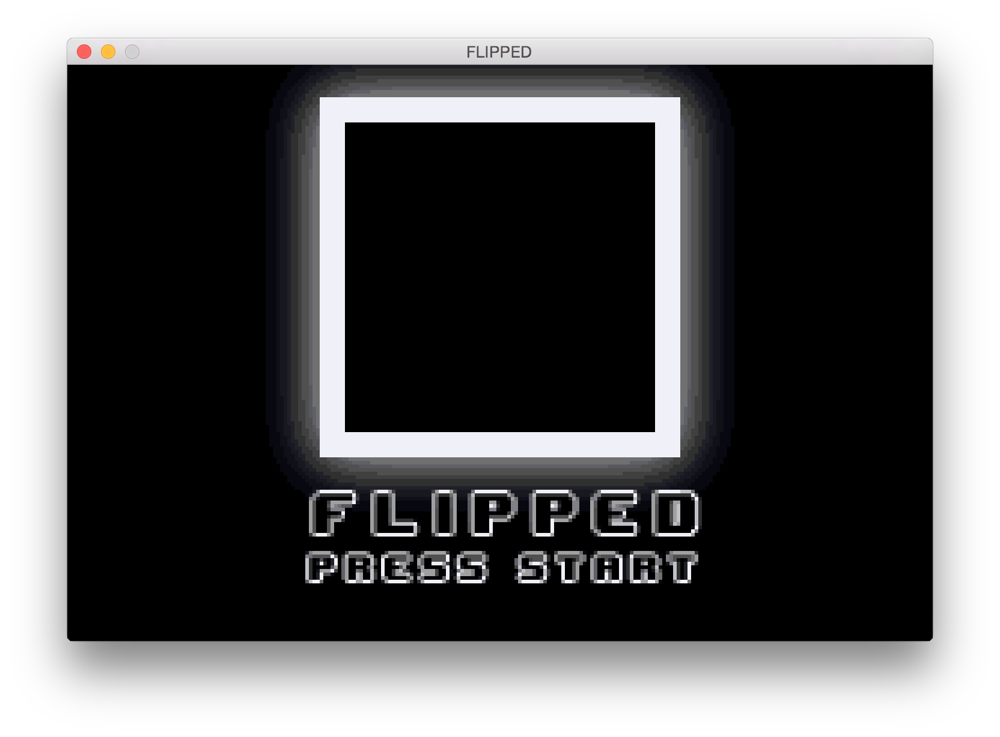
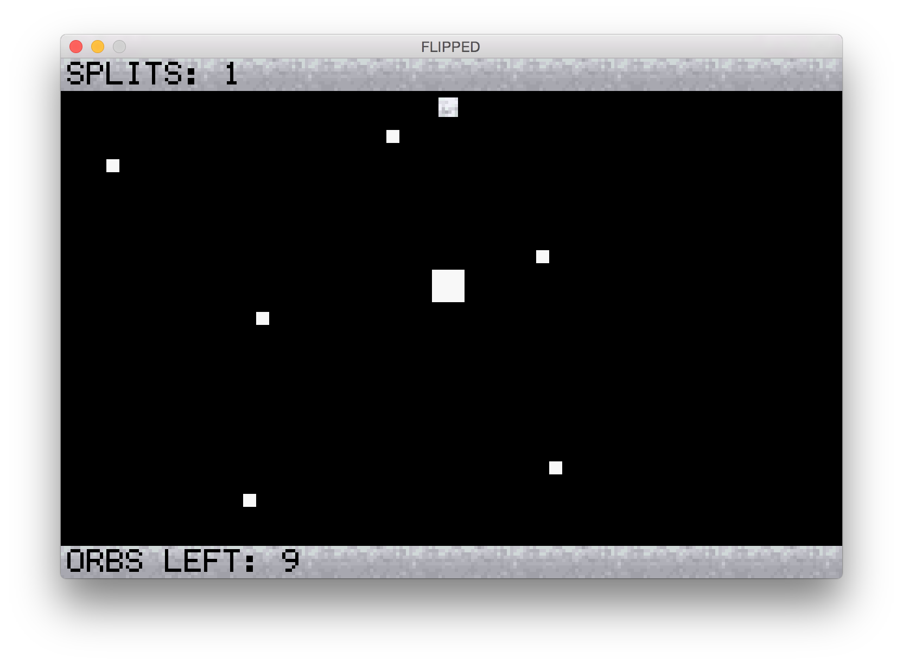
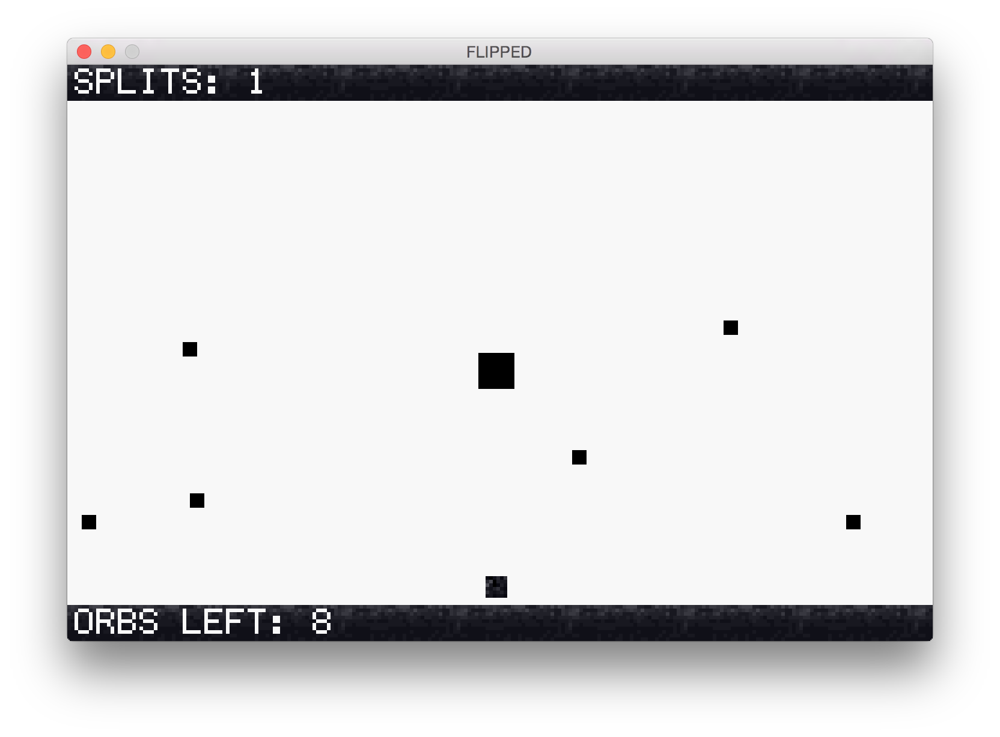
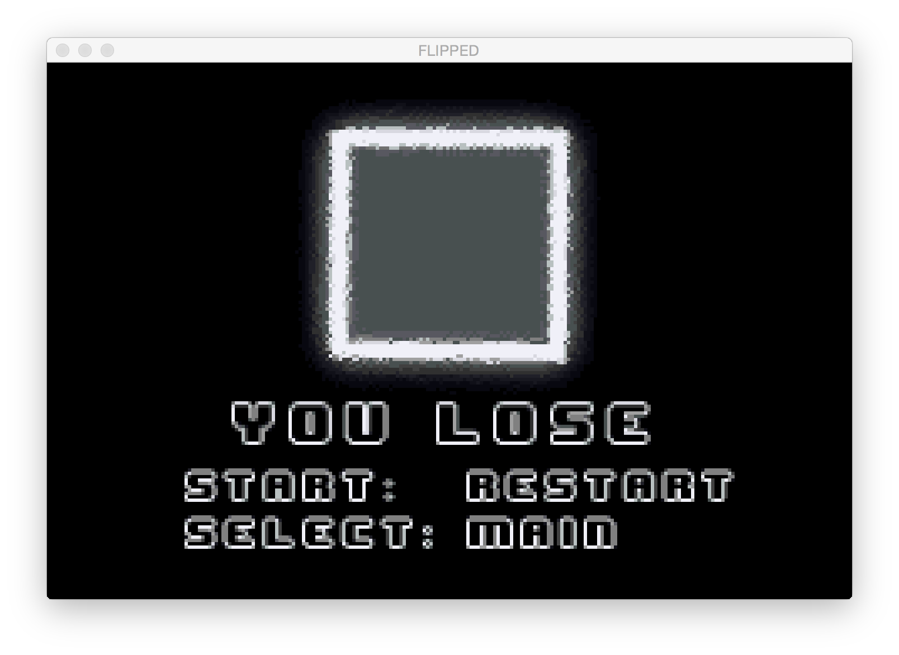

# RGBDROP
### GameBoyGame for CS2110 (MODE4)
PROGRAMMED IN C WITH TEARS AND SADNESS OVER A MILLION BUGS

### CONTROLS
- Press A to reverse the direction of the mainCharacter.
- Press B to use a "split" and reverse the direction of the obstacles.

### OBJECTIVE 
- You start off with one "split" which can be depleted in order to reverse the direction of the obstacles.
- You win by collecting the 10 animated orbs. Every two collected orbs generates a split, which you can press b to reverse the velocities of the obstacles.
- You lose by getting hit by an obstacle.

### Running the game
To run it, download the RGBDROP.gba file. You need to download a VBA-M emulator and run the RGBDROP.gba file.

Alternatively you can download the CS2110 tools for georgia tech that'll allow you to call `make vba` and automatically run the files.

